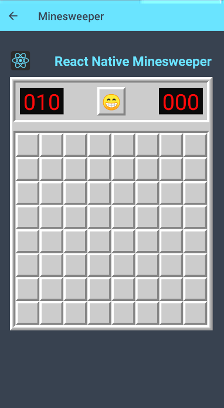

# ⚛️ React Native Minesweeper 🚩 💣 🕹

Minesweeper made using React Native and Typescript! 😎





## Installation

```bash
# Clone this repository
$ git clone https://github.com/musoxvi/rn-minesweeper.git rn-minesweeper

# Go into the repository
$ cd minesweeper

# Install dependencies
$ npm install
```

## Available Scripts

In the project directory, you can run:

```bash
#For IOS
$cd ios pod install

# Run the server
$ npm run start

# Run the app (iOS)
$ npm run ios

# Run the app (Android)
$ npm run android
```

## License

[MIT](https://choosealicense.com/licenses/mit/)
